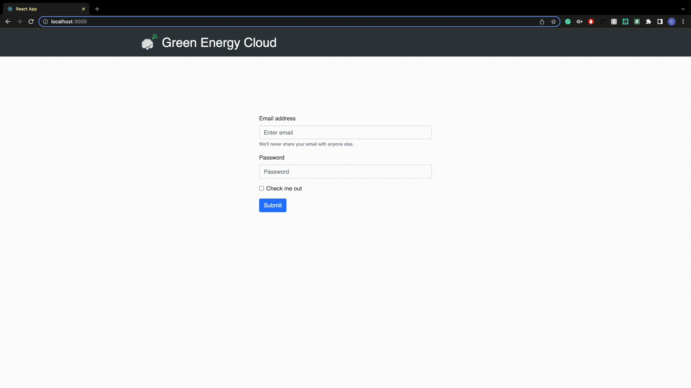
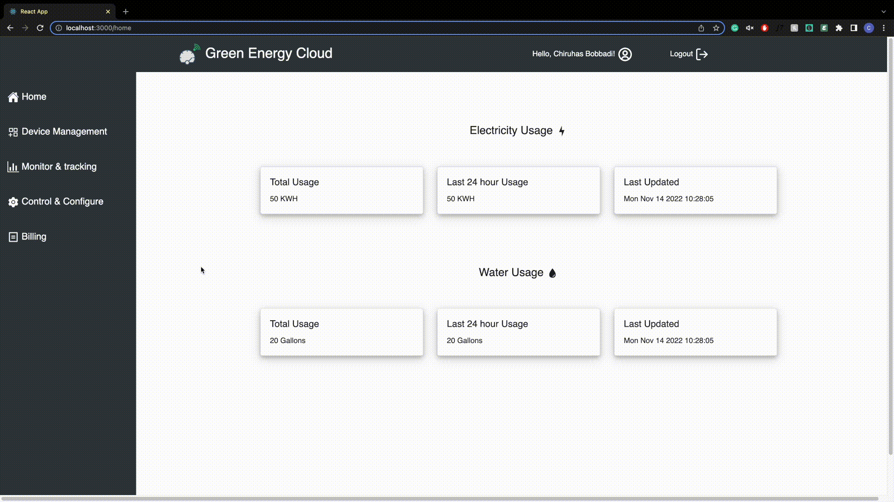
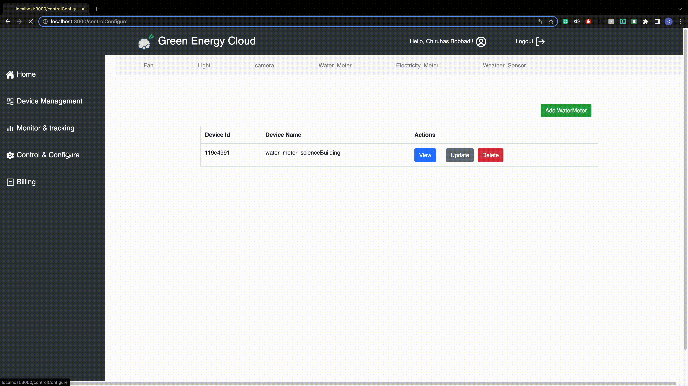

# IoT Dashboard for various connected devices & smart meters.

This project was part of our CMPE 281 final project at San jose State University.

Project Objectives:
1. Setting up an IoT simulator (we used AWS IoT simulator)
2. This simulator later feeds data to the nodejs server which later feeds that into mongodb database, both of which are hosted on different EC2 instances.
3. A user Interface which supports viewing the devices the user has running and their various utilization metrics.
4. Control and Configure those devices
5. Device Management
6. A billing section, which estimates the bill based on utilization

# Tech Stack.
## Front End
For front end we used React.js framework as the ui has many areas where maintaining the state of the application is essential and to facilitate micro interactions to help enhance user experience.

## Back End
1. Node.js server to handle API calls and database connectivity
2. Mongodb to store device data from IoT simulator
3. mySQL db to store user and device related information

The backend project is on [this](https://github.com/ChiruhasBobbadi/dashboard_server) repository 

# Sections of the Application
## 1. Authentication

## 2. Home Page

## 3. Device Management

## 4. Control & Configure

## 5. Monitor & Tracking

## 6. Billing

Connect with me on [LinkedIn](https://www.linkedin.com/in/chiruhas-bobbadi/) 

